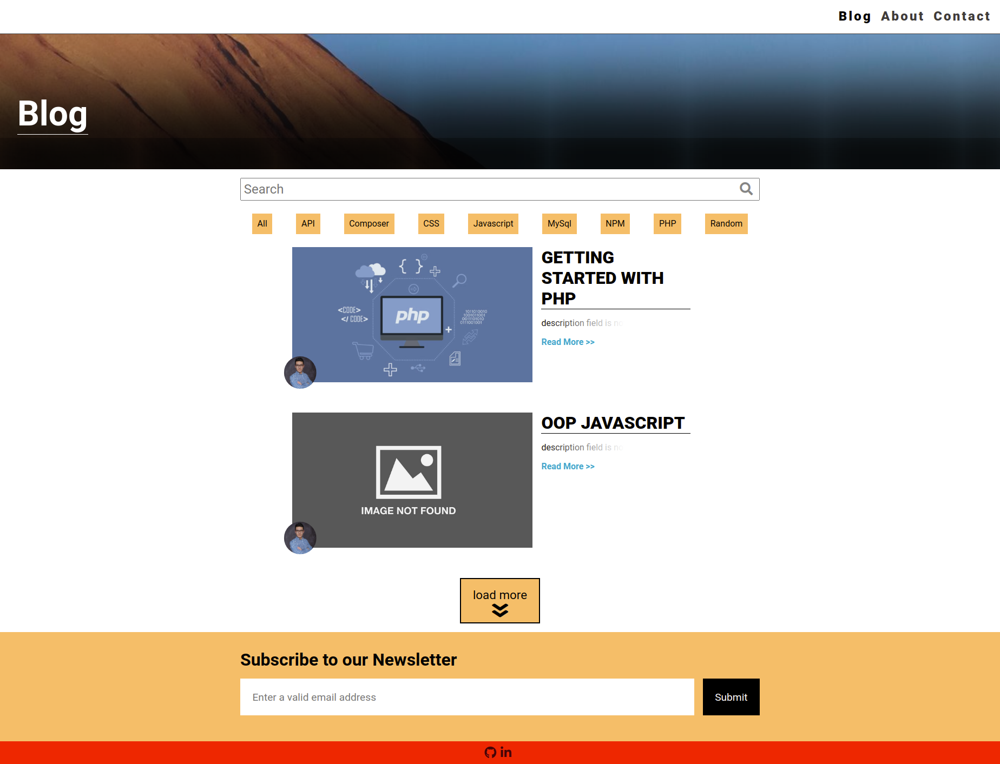
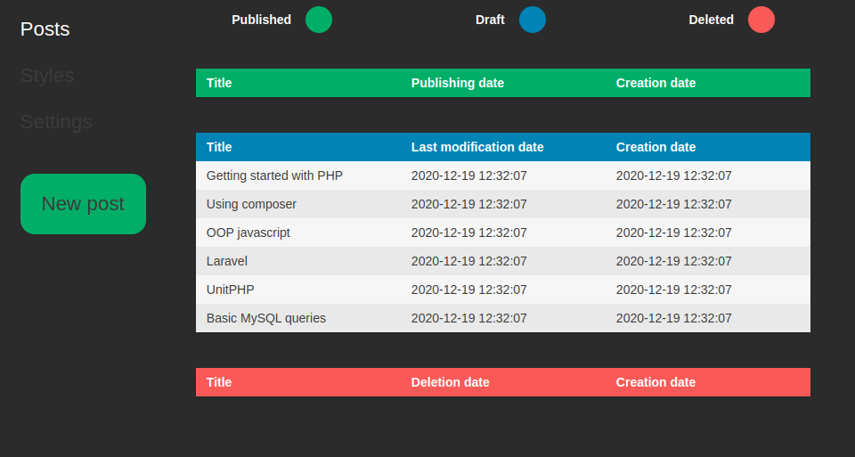
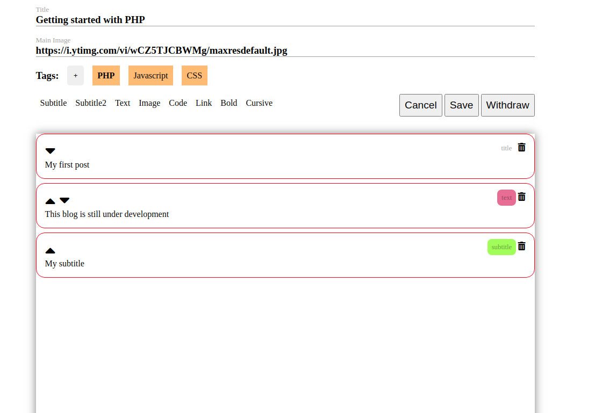

[![LinkedIn][linkedin-shield]][linkedin-url]


<!-- PROJECT LOGO -->
<br />
<p align="center">


  <h1 align="center">CMS FOR A BLOG</h1>
    <p align='center'>
  <a href='https://tonijorda.com/myProjects/PHP/blogCMS/blog.php'>View Demo*</a>
  This demo corresponds to the next version.
  </p>
</p>


<!-- ABOUT THE PROJECT -->
## About The Project
Control management system for a blog. It allows to create, edit, publish and withdraw posts. You can find the next version of this project
    <a href="https://github.com/Skebard/CMS-for-blog-with-MVC-model">here.</a>


- Main page

<br>
- Post

<br>

- Admin panel

<br>

- Editor



### Built With

The frontend has been done with:
- JS
- CSS
- HTML

And the backend with:
- PHP (7.4)

To send mail phpmailer has been used:
- https://github.com/PHPMailer/PHPMailer


<!-- GETTING STARTED -->
###  Getting Started


1. Clone the repo
   ```sh
   git clone https://github.com/Skebard/marvel.git
   ```
2. Set your database credentials in Private/classes/dbh.class.php
3. Set your email configuration in Private/sendemail.php. Notive that you will have to create a new folder, under the root directory, called Password and inside it a file password.php where you have to declare a variable such as
```
$pass = 'your gmail password';
```
4. Finally start the database and the server. For this step you might use XAMPP or you could directly use MySql and run a server with php in the terminal
```
php -S localhost:8000
```


<!-- CONTRIBUTING -->
### Contributing

Contributions are what make the open source community such an amazing place to be learn, inspire, and create. Any contributions you make are **greatly appreciated**.

1. Fork the Project
2. Create your Feature Branch (`git checkout -b feature/AmazingFeature`)
3. Commit your Changes (`git commit -m 'Add some AmazingFeature'`)
4. Push to the Branch (`git push origin feature/AmazingFeature`)
5. Open a Pull Request


[linkedin-shield]: https://img.shields.io/badge/-LinkedIn-black.svg?style=for-the-badge&logo=linkedin&colorB=555
[linkedin-url]: http://www.linkedin.com/in/tjorda
